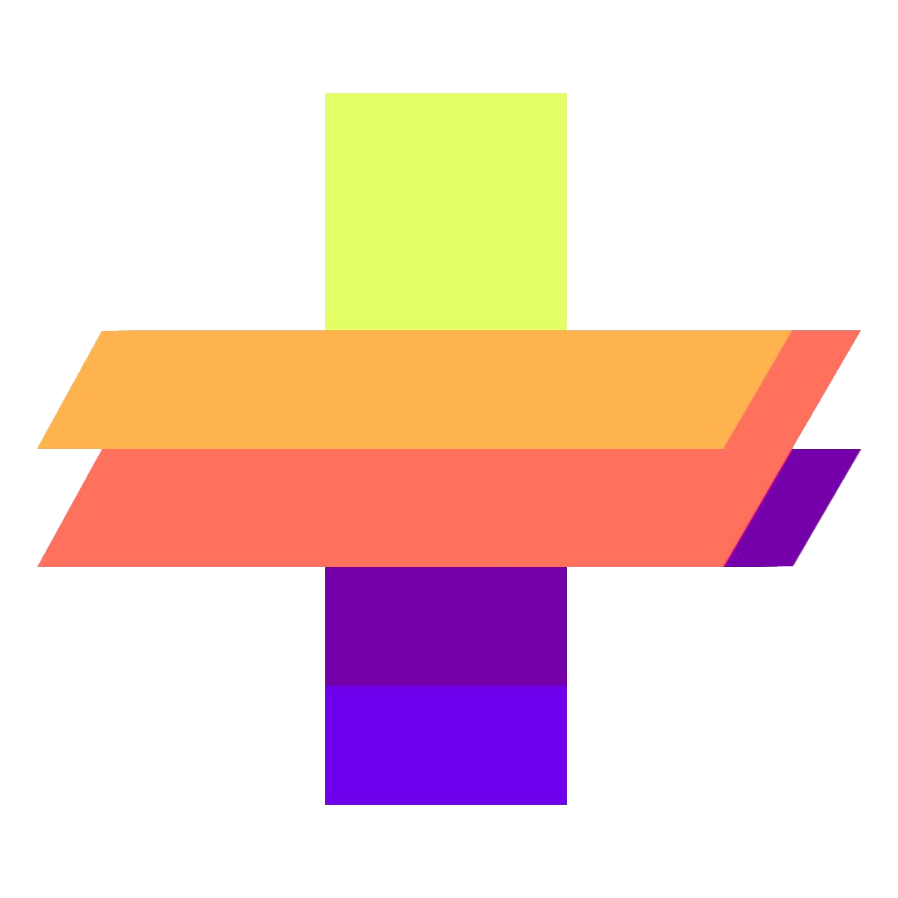

# C.O.L.O.R.S
**Colors Output Layout Of Random Schemes**

> [https://colors.softplus.fr/](https://colors.softplus.fr/)
---

Generate your own color scheme quickly ! 

### Future features
```
- fix grab on touchscreen (if possible ?)
- implementing generation using monochromatic, analogous, complementary, split complementary, triadic square and rectangle schemes
```